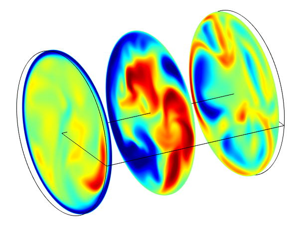

Over the years I have developed a few Navier-Stokes solvers to suit my research.
 
- **CDS3D**: A high-order, high fidelity solver for compressible Navier-Stokes equations in generalized curvilinear coordinates. The code uses a high-order compact difference scheme for spatial discretization with filtering operators.

- **InCurvCDS**: An incompressible Navier-Stokes solver in the generalized curvilinear coordinates. InCurvCDS uses high-order compact difference scheme and filtering operators. It can simulate flow problems with and without thermal stratification in complex domains using body-fitted grids. The code is written in modern Fortran using derived data types to keep it generic. It is further enhanced to simulate the Non-Boussinesq flows. Recently, the solver is extended to simulate the multiphase flows.

- **VEflow**: An incompressible Navier-Stokes solver in the cylindrical coordinates written in Fortran90. The solver employs fractional-step algorithm and uses central-difference scheme on a fully staggered grid.

- **FTLE3D**: A Fortran90 program to compute the three-dimensional Finite Time Lyapunov Exponent from raw velocity data.

  

    <!--  -->
    
  

  

    **VEflow**: An incompressible Navier-Stokes solver in the cylindrical coordinates written in Fortran90. The solver employs fractional-step algorithm and uses central-difference scheme on a fully staggered grid.
  

